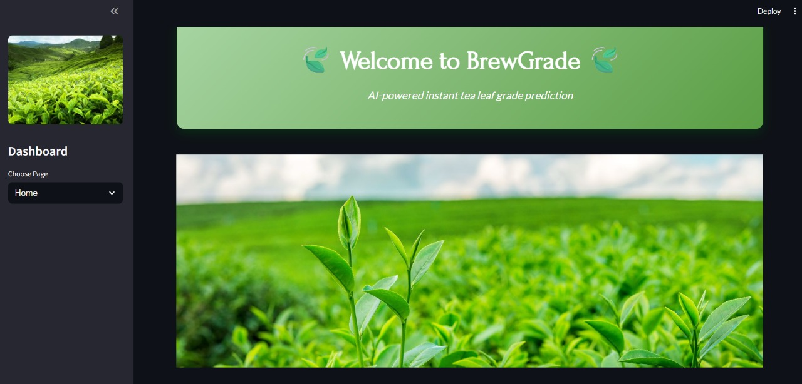
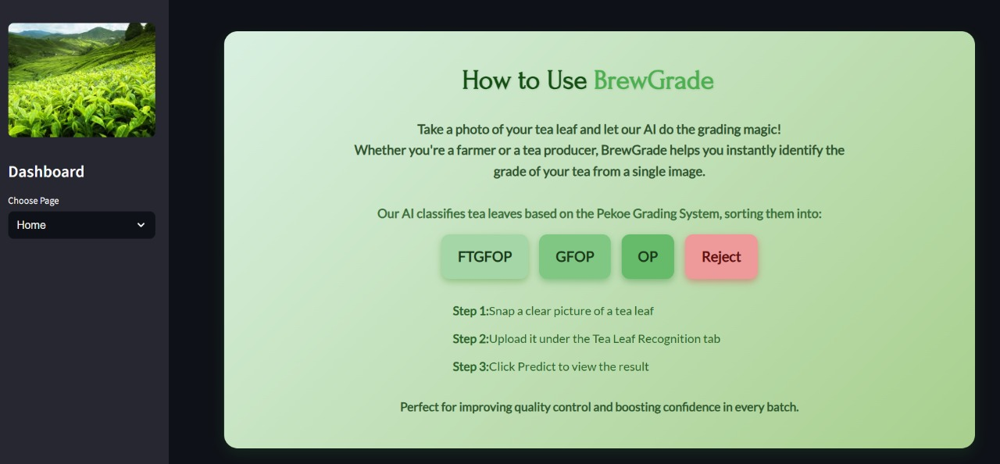
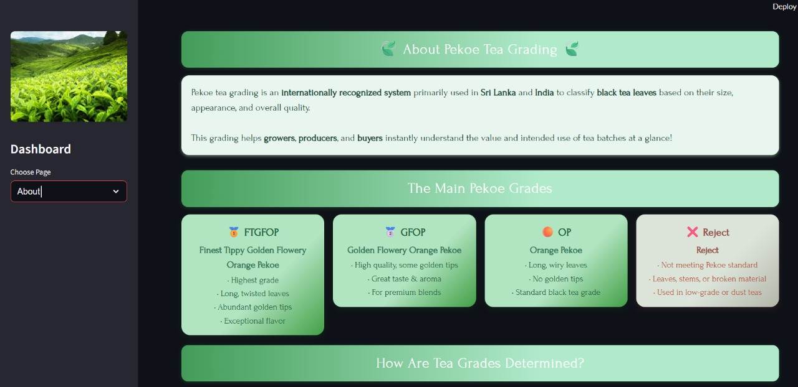
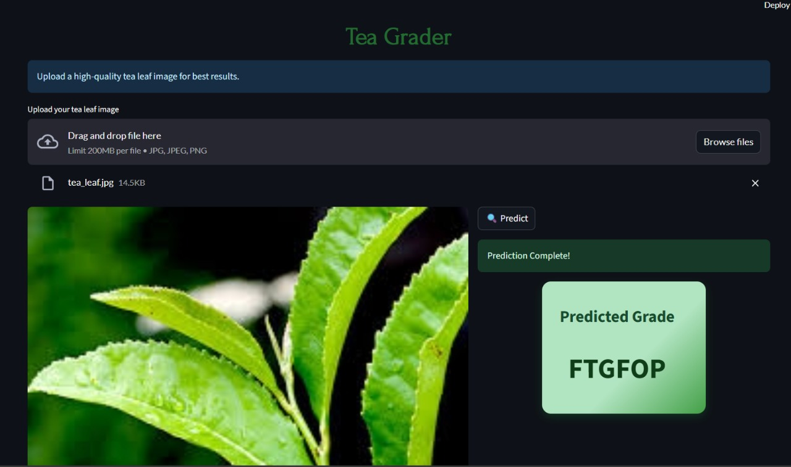

# BrewGrade: AI-Powered Tea Leaf Grade Prediction

Welcome to BrewGrade, an innovative AI-powered application designed to predict tea leaf grades using computer vision. This project empowers tea farmers and producers by classifying tea leaves into four pekoe grades: FTGFOP (Finest Tippy Golden Flowery Orange Pekoe), GFOP (Golden Flowery Orange Pekoe), OP (Orange Pekoe), and Reject. Built with MobileNetV2 for feature extraction and a Support Vector Machine for classification, BrewGrade offers a fast, reliable, and user-friendly solution for tea quality assessment.

## Project Overview

BrewGrade leverages advanced computer vision techniques to analyze tea leaf images and determine their quality grade. The application is ideal for:
- **Tea Farmers**: For quality control and grading at the source.
- **Tea Producers**: To streamline production and ensure consistency.
- **Enthusiasts**: To explore tea grading with cutting-edge technology.

The project uses MobileNetV2, a lightweight Convolutional Neural Network (CNN) pre-trained on ImageNet, to extract features, followed by a Support Vector Machine(SVM) for grade prediction, achieving an accuracy of approximately 84% on the test set. The Streamlit-based web app provides an intuitive interface for uploading images and receiving instant predictions.

## Dataset

The BrewGrade model was trained on a dataset downloaded from Roboflow, consisting of tea leaf images categorized into four initial labels (T1, T2, T3, T4), which were mapped to FTGFOP, GFOP, OP, and Reject respectively.

### Dataset Details
- **Source**: Obtained via Roboflow from the ["tea-dataset-w9n3c"](https://universe.roboflow.com/tea-dataset-w9n3c/tea-leaves-dataset) workspace, project "tea-leaves-dataset", version 1, in COCO format.
- **Size**: 
  - Total images: Approximately 1,766 (based on the train set annotation file).
  - Split into train, validation, and test sets (exact split sizes depend on Roboflow's default distribution).
- **Preprocessing**: Images are resized to 224x224 pixels and preprocessed using MobileNetV2's `preprocess_input` function. The dataset includes augmentation techniques like rotations, flips, and brightness adjustments (implicit in the notebook's intent).
- **Annotations**: Initially labeled as T1, T2, T3, T4, and remapped to FTGFOP, GFOP, OP, and Reject using a custom label mapping.

The dataset is stored locally after download. This grading system can be widened by incorporating a custom dataset with additional grades or regional variations, enhancing its adaptability.

### Citation
```bibtex
@misc{tea-leaves-dataset_dataset,
  title = { Tea Leaves Dataset Dataset },
  type = { Open Source Dataset },
  author = { Tea Dataset },
  howpublished = { \url{ https://universe.roboflow.com/tea-dataset-w9n3c/tea-leaves-dataset } },
  url = { https://universe.roboflow.com/tea-dataset-w9n3c/tea-leaves-dataset },
  journal = { Roboflow Universe },
  publisher = { Roboflow },
  year = { 2023 },
  month = { dec },
  note = { visited on 2025-08-01 },
}
``` 

## Model Training

### Architecture  
BrewGrade employs a hybrid approach:

- **Feature Extractor**: `MobileNetV2`, a pre-trained Convolutional Neural Network (CNN) on ImageNet, extracts features from tea leaf images using average pooling (`GlobalAveragePooling2D`) to generate fixed-size feature vectors.  
- **Classifier**: A **Support Vector Machine (SVM)** with an RBF kernel classifies the extracted features into four Pekoe grades.

---

### Training Process

- **Frameworks Used**:  
  - **TensorFlow** – For CNN-based feature extraction using MobileNetV2.  
  - **scikit-learn** – For SVM classification and hyperparameter tuning.

- **Data Preparation**:  
  - Tea leaf images are resized to `224x224` pixels and preprocessed using MobileNetV2’s `preprocess_input()` function.  
  - Features are extracted from both training and validation sets.  
  - Labels are encoded using `LabelEncoder` from scikit-learn.  
  - Dataset is split into 80% training and 20% testing using `train_test_split` with `test_size=0.2`.

- **Hyperparameter Tuning**:  
  - SVM parameters `C` and `gamma` were tuned on the validation set using a grid search strategy.  
  - Grid Search Space:
    - `C`: `[0.1, 1, 10, 100]`  
    - `gamma`: `['scale', 0.01, 0.001]`  
  - Models were evaluated using **macro-averaged F1-score** to ensure balanced performance across all classes.  
  - The best parameters found were:  
    ```python
    {'C': 10, 'gamma': 'scale'}  
    ```

- **Hardware Requirements**:  
  - The model can be trained and run on both **CPU and GPU**.  
  - Feature extraction using MobileNetV2 benefits from GPU acceleration (e.g., NVIDIA GTX 1080 or higher).


### Model Saving
The trained Random Forest model can be saved using joblib (e.g., as `tea_model.pkl`), though the notebook does not explicitly save it. The label encoder can be saved as `label_encoder.pkl`.

## Accuracy Scores

The BrewGrade model achieved the following performance metrics on the final test set:
- **Accuracy**: ~84%
- **Precision**:
  - FTGFOP: 0.91
  - GFOP: 0.72
  - OP: 0.85
  - Reject: 0.92
- **Recall**:
  - FTGFOP: 0.89
  - GFOP: 0.82
  - OP: 0.76
  - Reject: 0.89
- **F1-Score**:
  - FTGFOP: 0.90
  - GFOP: 0.77
  - OP: 0.80
  - Reject: 0.90
- **Macro Avg**: 0.85 (precision), 0.84 (recall), 0.84 (f1-score)
- **Weighted Avg**: 0.85 (precision), 0.84 (recall), 0.84 (f1-score)

These scores indicate a robust model, with strong performance across all classes. The accuracy could potentially be improved further with a larger dataset or hyperparameter tuning.


## Streamlit App

BrewGrade is an AI-powered Streamlit app for predicting tea leaf grades using the Pekoe Grading System. It has three main pages: Home, About, and Tea Grading.

### Home Page
- **Overview**: Welcomes users with a gradient banner and tea leaf image.
- **Content**: Introduces AI-powered grading, lists Pekoe grades (FTGFOP, GFOP, OP, Reject), and provides usage steps (snap, upload, predict).
- **Screenshot**:
  
   ### How to Use TeaVision
1. **Snap a stunning tea leaf photo!**
2. **Let computer vision unveil its pekoe grade.**
3. **Perfect for farmers & tea producers to classify.**
 

### About Page
- **Overview**: Explains the Pekoe Grading System used in Sri Lanka and India.
- **Content**: Details FTGFOP, GFOP, OP, and Reject grades in cards, grading criteria (shape, tips, etc.), and its importance for farmers and buyers.
- **Screenshot**:
  

  #### Pekoe Grades Unveiled
- **FTGFOP**: Finest Tippy Golden Flowery Orange Pekoe – Elite quality!
- **GFOP**: Golden Flowery Orange Pekoe – Rich with golden tips.
- **OP**: Orange Pekoe – Classic wiry leaves.
- **Reject**: Not up to the mark.

### Tea Grading Page
- **Overview**: Core feature for uploading and predicting tea leaf grades.
- **Content**: Image uploader, two-column layout (image display, predict button), and AI-driven grade prediction (MobileNetV2 + SVM).
- **Screenshot**:
  

  ### Running the App
1. Install dependencies (see below).
2. Place a `home_page.jpg` and `home.jpg` (sidebar logo) in the project directory.
3. Run the app with: `streamlit run tea_grade_app/app.py`.

## Installation

### Prerequisites
- Python 3.8+
- pip

### Dependencies
Install the required packages using:
```bash
pip install streamlit numpy joblib pillow tensorflow scikit-learn opencv-python roboflow matplotlib seaborn
```
## Installation

### Prerequisites
- Python 3.8+
- pip

### Dependencies
Install the required packages using:
```bash
pip install streamlit numpy joblib pillow tensorflow scikit-learn opencv-python roboflow matplotlib seaborn
```

### Clone the repository
```bash
git clone https://github.com/your-username/teavision.git
cd teavision
```

### Model Files
- Download or train the model using `tea_proejct.ipynb` to generate `tea_model.pkl` and `label_encoder.pkl`.
- Place them in the project root directory.


## Usage

1. Launch the Streamlit app:
   ```bash
   streamlit run tea_grade_app/app.py
   ```
   
2.Navigate using the sidebar:
- Home: View the welcome message and usage guide.
- About: Learn more about the project.
- Tea Grading: Upload an image and click "Predict" to see the grade.

3. Upload a clear, well-lit tea leaf image for best results.

## Future Improvements

This project could be further enhanced by:

- Widening the Grading System: Incorporating a custom dataset with additional grades or regional tea varieties to increase versatility.
- User Features: Adding batch processing or real-time camera input for enhanced usability.

## License

This project is licensed under the MIT License - see the LICENSE file for details.

## Acknowledgments

- Thanks to the tea farming community and Roboflow for dataset inspiration.
- Built with love using TensorFlow, scikit-learn, Streamlit, and OpenCV.

Happy grading with BrewGrade! 🍵


